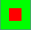

<!-- PROJECT LOGO -->
<br />
<p align="center">
  <a href="https://github.com/othneildrew/Best-README-Template">
    
  </a>

  <h3 align="center">Attack on Tower</h3>
</p>


<!-- ABOUT THE PROJECT -->
## About The Project

[![Product Name Screen Shot][product-screenshot]](https://example.com)

Attack on Tower is a tower defense game made with pygame.


### Built With

* [python](https://python.org)
* [pygame](https://www.pygame.org/news)


<!-- GETTING STARTED -->
## Getting Started

### Prerequisites

* python 3.7+ 
  [python download page](https://www.python.org/downloads/)

### Installation

1. Clone the repo
   ```sh
   git clone https://github.com/sulyak/AttackOnTower.git
   ```
2. Install python requirements
   ```sh
   python -m pip install -r requirements.txt
   ```


<!-- USAGE EXAMPLES -->
## Usage

   run game.py
   ```sh
   python game.py
   ```


<!-- CONTACT -->
## Contact

Rayner Sulyak - raynersulyak@gmail.com
Project Link: [https://github.com/sulyak/AttackOnTower](https://github.com/sulyak/AttackOnTower)


<!-- MARKDOWN LINKS & IMAGES -->
<!-- https://www.markdownguide.org/basic-syntax/#reference-style-links -->
[contributors-shield]: https://img.shields.io/github/contributors/othneildrew/Best-README-Template.svg?style=for-the-badge
[contributors-url]: https://github.com/othneildrew/Best-README-Template/graphs/contributors
[forks-shield]: https://img.shields.io/github/forks/othneildrew/Best-README-Template.svg?style=for-the-badge
[forks-url]: https://github.com/othneildrew/Best-README-Template/network/members
[stars-shield]: https://img.shields.io/github/stars/othneildrew/Best-README-Template.svg?style=for-the-badge
[stars-url]: https://github.com/othneildrew/Best-README-Template/stargazers
[issues-shield]: https://img.shields.io/github/issues/othneildrew/Best-README-Template.svg?style=for-the-badge
[issues-url]: https://github.com/othneildrew/Best-README-Template/issues
[license-shield]: https://img.shields.io/github/license/othneildrew/Best-README-Template.svg?style=for-the-badge
[license-url]: https://github.com/othneildrew/Best-README-Template/blob/master/LICENSE.txt
[linkedin-shield]: https://img.shields.io/badge/-LinkedIn-black.svg?style=for-the-badge&logo=linkedin&colorB=555
[linkedin-url]: https://linkedin.com/in/othneildrew
[product-screenshot]: images/screenshot.png
